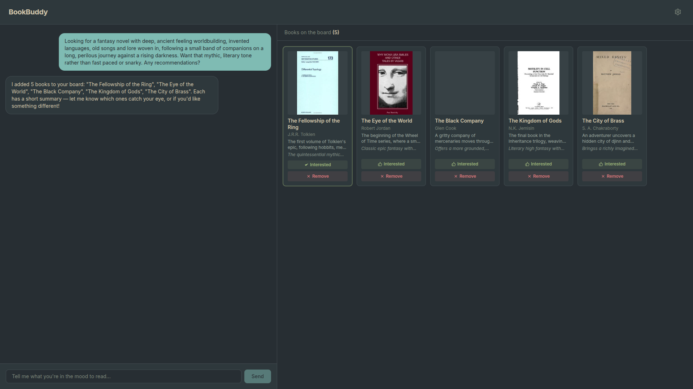

# BookBuddy



**BookBuddy** is an AI-powered book recommendation app. Instead of a static
search box, you describe what you're in the mood to read — in plain language —
and an LLM carries on a conversation with you while curating a visual board of
real, searchable books.

Every recommendation is backed by a live book search (Google Books, with an
Open Library fallback), so the AI never has to invent titles. It learns as you
go: mark books "Interested" to find more like them, or remove ones that aren't
for you.

## Features

- **Conversational discovery** — describe a mood, genre, or seed book in
  natural language ("philosophical fantasy like The Name of the Wind") and the
  AI asks clarifying questions until it has enough to recommend.
- **Real book search via AI tool calls** — the model drives `searchBooks`,
  `addToBoard`, and `removeFromBoard` function calls against the Google Books
  API (Open Library as an automatic fallback), so every suggestion is a real,
  verifiable title.
- **Visual book board** — recommendations appear as cover cards you can mark
  "Interested" or "Remove" in one click; a details drawer shows a summary and
  why each book fits your taste.
- **Learns what you've read** — if you mention finishing a book, BookBuddy
  detects it and won't re-suggest it.
- **Bring your own AI** — any OpenAI-compatible model provider works; defaults
  to OpenRouter. The model list is fetched live from your chosen provider.
- **Settings persisted locally** — API key, base URL, and model are stored in
  `localStorage`.
- **Fully serverless** — deployed as a Cloudflare Worker (Workers + Assets),
  no server to manage.

## How it works

1. You tell BookBuddy what you're in the mood to read.
2. The LLM translates your request into targeted search queries and calls the
   `searchBooks` tool against the Google Books API (falling back to Open
   Library when needed).
3. It evaluates the results in its context window, filtering out anything that
   doesn't match your constraints (e.g. "no romance"), and calls `addToBoard`
   with 5 curated picks.
4. You react to the board — marking books "Interested" or "Remove" — and keep
   chatting. BookBuddy refines subsequent searches and never re-suggests books
   you've ruled out or already finished.

## Tech stack

- **Frontend:** React 19, TypeScript, Tailwind CSS v4, Vite
- **Backend:** Cloudflare Workers (Hono), served locally via `@hono/node-server`
- **AI:** OpenAI SDK → any OpenAI-compatible API (defaults to OpenRouter; bring
  your own key)
- **Book search:** Google Books API (primary) with Open Library API fallback
- **Testing:** Vitest (unit tests for the search tools)

## Getting started

```bash
git clone <repo-url>
cd book-buddy
npm install
npm run dev
```

`npm run dev` starts two processes:

- Frontend on `http://localhost:5173` (Vite proxies `/api` → `:4000`)
- Backend dev server on `http://localhost:4000`

Open the app, click the gear icon (top-right), and paste your OpenRouter API
key. Click **Fetch** to load available models, pick one, and save.

## API keys

1. **OpenRouter (required):** Sign up at [OpenRouter](https://openrouter.ai),
   create a key, and paste it in Settings.
2. **Google Books (recommended):** Google Books is the primary search provider.
   Get a free key from the
   [Google Cloud console](https://console.cloud.google.com/apis/library/books.googleapis.com).
   In production, store it as a Cloudflare Worker secret so it's used for every
   visitor:

   ```bash
   npx wrangler secret put GOOGLE_BOOKS_API_KEY
   ```

   For local development with `wrangler dev`, put it in a `.dev.vars` file
   instead (`GOOGLE_BOOKS_API_KEY=...`).

   If no Google Books key is configured, BookBuddy automatically falls back to
   the Open Library API (no key required).

## Deployment

The app ships as a Cloudflare Worker with static assets:

```bash
npm run deploy   # builds the frontend, then runs wrangler deploy
```

GitHub Actions CI/CD runs `format:check`, `typecheck`, `lint`, and `build` on
every push/PR, then auto-deploys to Cloudflare when merged to `main`.

## Project structure

```
├── src/
│   ├── components/      # UI: chat, book board, details drawer, settings
│   ├── hooks/           # useChat — chat state, board state, settings
│   ├── lib/             # settings persistence, shared constants
│   ├── worker/          # Cloudflare Worker (Hono): chat + models endpoints,
│   │                    # book-search tools, and their unit tests
│   ├── api/             # frontend API client for the backend
│   ├── App.tsx          # two-panel layout: chat (left) + book board (right)
│   └── main.tsx
├── wrangler.jsonc       # Cloudflare Worker + assets config
├── vite.config.ts
└── package.json
```

## Scripts

| Command               | Description                          |
| --------------------- | ------------------------------------ |
| `npm run dev`         | Run frontend + backend dev servers   |
| `npm run build`       | Build the frontend (Vite)            |
| `npm run deploy`      | Build + deploy to Cloudflare Workers |
| `npm test`            | Run Vitest unit tests                |
| `npm run typecheck`   | TypeScript type checking             |
| `npm run lint`        | ESLint                               |
| `npm run format:check`| Prettier check                       |